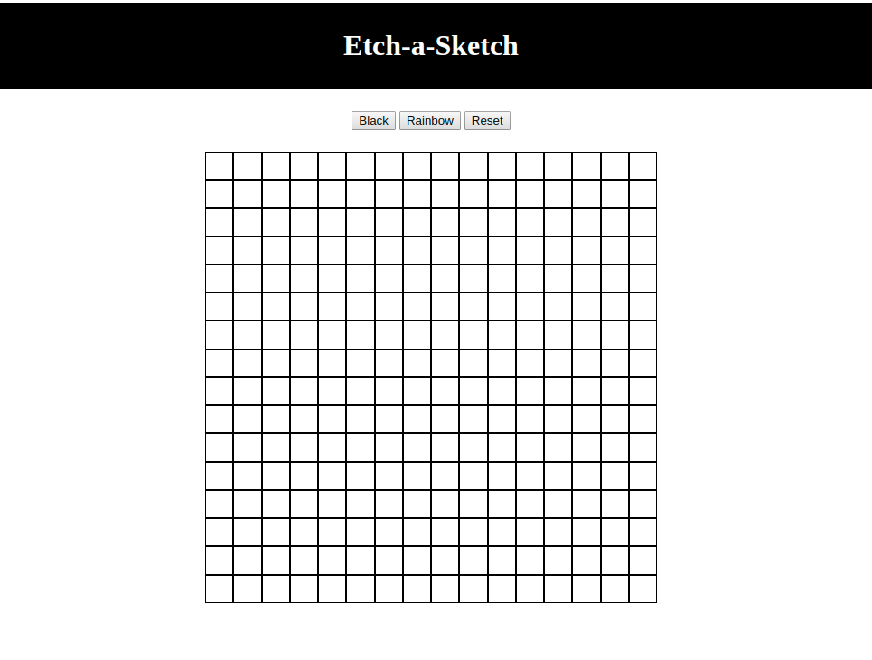

# Etch a Sketch
This is a Javascript project for learning how grid and hover works

# From the Odin Project
*Link to the [requirements](https://www.theodinproject.com/courses/web-development-101/lessons/etch-a-sketch-project) in the Odin Project*

## Live Demo

[Live Demo Link](https://nriqu322.github.io/etch-a-sketch/)

## Made with
* Javascript
* HTML5
* CSS3

## Built With
* Functions on javascript
* Statements for/while.
* Grid

## Author 

👤 **Luis Saavedra**

- Github: [@githubhandle](https://github.com/nriqu322)
- Twitter: [@twitterhandle](https://twitter.com/nriqu322)
- Linkedin: [Luis Saavedra](https://linkedin.com/in/luis-saavedra-sanchez/)

## Contributing

Contributions, issues and feature requests are welcome!

Feel free to check [here](https://github.com/nriqu322/etch-a-sketch/issues) for issues.

## Show your support
Give a ⭐️ if you like this project!